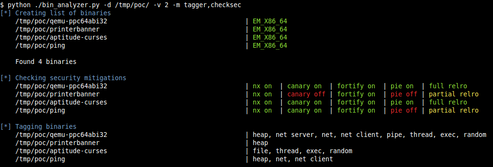

# BinAnalyzer
Toy project for static analysis of ELF binaries

## Help
```
usage: bin_analyzer.py [-h] [-l] [-d DIR] [-v VERBOSE] [-m MODS] [-x]
                       [--no-color]

optional arguments:
  -h, --help            show this help message and exit
  -l, --list            list modules
  -d DIR, --dir DIR     directory of binaries
  -v VERBOSE, --verbose VERBOSE
                        control verbosity (1-3)
  -m MODS, --mods MODS  run only this list of modules (sep by comma) <default:
                        all>
  -x, --exclude         do not run this list of modules (used with -m)
  --no-color            disable coloring
```

## Modules
```
[*] Modules availables
    checksec             - analyze security mitigations
    dangerous            - find use of dangerous functions
    finddeps             - find dependencies of a binary
    sha1sum              - compute and check SHA1 message digest
    strings              - look for interesting strings
    tagger               - try to identify the purpose of binary and tag it
    topfuncref           - list top 10 functions referenced

```

## Example

